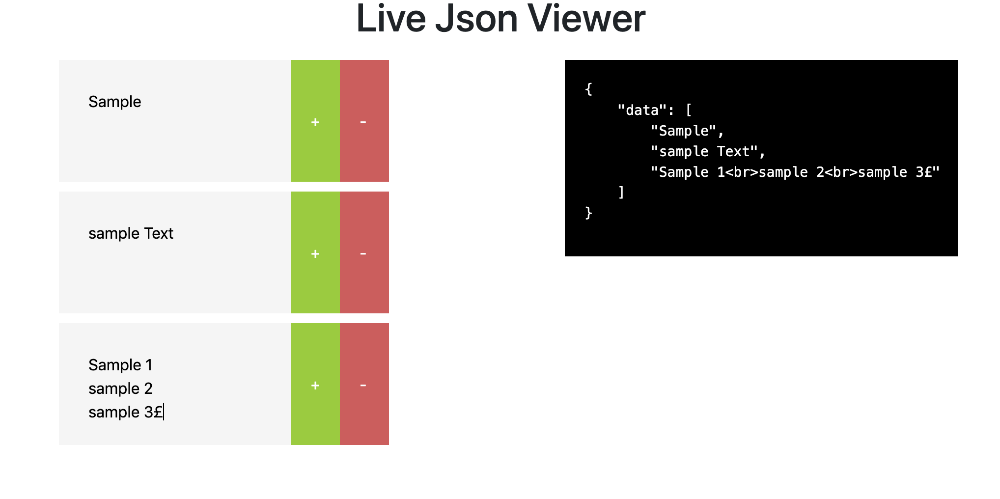

# Live Json Viewer

### Description

This application allows the user to add and remove the list of items and it will
display the user entered text in json format.


###### Sample screen:



### Get it running

- Install the dependencies -  ``` npm install ```
- Run the application - ``` npm start ```
- Run the tests - ``` npm test ```
